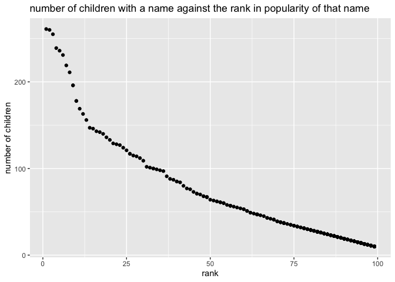

p8105\_hw2\_wz2507
================
Wurongyan Zhang
9/25/2019

## Problem 1

``` r
# load library
library(readxl)
library(tidyverse)
library(ggplot2)
```

``` r
# Import the trash wheel data set
trash <- read_excel("data/Trash-Wheel-Collection-Totals-8-6-19.xlsx", sheet = 1, range = "A2:N408") %>% 
  janitor::clean_names() %>% #clean names
  drop_na(dumpster) %>% #drop non dumpster data
  #round the number of sports balls
  mutate(
    sports_balls = as.integer( sports_balls)) 
```

``` r
# import precipatation data for 2018
trash18 <- read_excel("data/HealthyHarborWaterWheelTotals2018-7-28.xlsx", sheet = 3, range = "A2:B14") %>% 
  janitor::clean_names() %>% 
  mutate(Year = "2018") %>% #add the variable year
  mutate(month = month.name) %>% #change to full month names
  drop_na()  #omit rows without data
```

``` r
# create precipatation data for 2018
trash17 <- read_excel("data/HealthyHarborWaterWheelTotals2018-7-28.xlsx", sheet = 4, range = "A2:B14")%>% 
  janitor::clean_names() %>% 
  mutate(month = month.name) %>% #change to full month names
  mutate(Year = "2017") #add the variable year
```

``` r
#combine precipatation data for 2017 and 2018
precip1718 <- as.tibble(rbind(trash17, trash18))
```

``` r
# filter the data set only contains sports balls in 2017 in order to find the median
ball17 <- tibble(x = pull(trash, year ), y = pull(trash, sports_balls )) %>% 
  filter(x == "2017")
```

Comment: The number of observations in Mr.Trash Wheel data set is 344
with 14 variables and the number of observations in precipatation data
set is 19 with 3 variables.

The total precipatation in 2018 is 23.5. The median of sports ball is 8.
The key variables for trash data set include dumpter number (dumpster),
date of collection, amount of total litter (weight\_tons,
volume\_cubic\_yards) and litter types (plastic\_bottles, polystyrene,
cigarette\_butts, glass\_bottles, grocery\_bags, chip\_bags,
sports\_balls, etc.). For the precipatation data, it includes month,
year and the total precipitation amounts. The name of the columns are
shown below:

``` r
head(trash)
```

    ## # A tibble: 6 x 14
    ##   dumpster month  year date                weight_tons volume_cubic_ya…
    ##      <dbl> <chr> <dbl> <dttm>                    <dbl>            <dbl>
    ## 1        1 May    2014 2014-05-16 00:00:00        4.31               18
    ## 2        2 May    2014 2014-05-16 00:00:00        2.74               13
    ## 3        3 May    2014 2014-05-16 00:00:00        3.45               15
    ## 4        4 May    2014 2014-05-17 00:00:00        3.1                15
    ## 5        5 May    2014 2014-05-17 00:00:00        4.06               18
    ## 6        6 May    2014 2014-05-20 00:00:00        2.71               13
    ## # … with 8 more variables: plastic_bottles <dbl>, polystyrene <dbl>,
    ## #   cigarette_butts <dbl>, glass_bottles <dbl>, grocery_bags <dbl>,
    ## #   chip_bags <dbl>, sports_balls <int>, homes_powered <dbl>

``` r
head(precip1718)
```

    ## # A tibble: 6 x 3
    ##   month    total Year 
    ##   <chr>    <dbl> <chr>
    ## 1 January   2.34 2017 
    ## 2 February  1.46 2017 
    ## 3 March     3.57 2017 
    ## 4 April     3.99 2017 
    ## 5 May       5.64 2017 
    ## 6 June      1.4  2017

## Problem 2

``` r
# import pols data set
pols <- read_csv("data/pols-month.csv") %>% 
  #separate the date into year, month and day to 3 variables
  separate(mon, into = c("year", "month", "day")) %>% 
  #change month into full name
  mutate(month = as.integer(month)) %>% 
  mutate(month = month.name[month]) %>% 
  #specify if the president is democrat or republican by adding a new variable president
  mutate(prez_dem = recode(prez_dem, "1" = "democrat", "0" = "republican")) %>% 
  mutate(president =  prez_dem) %>% 
  #delete prez_dem, prez_gop and day
  select(-prez_dem, -prez_gop) %>% 
  select(-day)%>% 
  mutate(year = as.integer(year))
```

``` r
# import snp data set
snp <- read_csv("data/snp.csv") %>% 
  #convert the date into year, month and day
  separate(date, into = c("month", "day", "year")) %>%
  #change month into full name
  mutate(month = as.integer(month)) %>%
  #arrange the order by year, month and others
  arrange(year, month) %>% 
  select(year, month, everything()) %>% 
  mutate(month = month.name[month]) %>% 
  mutate(year = as.integer(year))
```

``` r
# import unemployment data set
une <- read_csv("data/unemployment.csv") %>% 
  janitor::clean_names() %>% 
  # change month to a column
  pivot_longer(jan:dec,
               names_to = "month", 
               values_to = "unemployment rate") %>%
  #change month into full name
  mutate(month = factor(month, labels = month.name))%>%
  #arrange the data by year, month and others
  arrange(year, month) %>% 
  select(year, month, everything())
```

``` r
#combine those three data sets
join = full_join(pols, une)
all = full_join(join, snp)
```

Comments: The dimension of the data set after combination is 828 entries
with 12 total columns (if we delete prez\_gop, prez\_dem and day). The
range of years is from 1947 to 2015. Specifically for each data set, the
dimension of pols data set is 822 entries with 9 columns ranging from
1947 to 2015; the dimension of snp data is 787 entries with 4 columns
ranging from 1950 to 2015 ; the dimension of unemplyment data is 816
entries with 3 columns ranging from 1948 to 2015. The names of key
variables are –

year: year of the count; month: month of the count of the year; day: the
day of the observation

rep\_dem: the number of democratic representatives on the associated
date

gov\_gop: the number of republican governors on the associated date

sen\_gop: the number of republican senators on the associated date

rep\_gop: the number of republican representatives on the associated
date

gov\_dem: the number of democratic governors on the associated date

sen\_dem: the number of democratic senators on the associated date

president: indicator of whether the president was democratic or
republican

close: the closing values of the S\&P stock index on the associated date

rate: unemployment rate

The columns included in every single data set are shown below:

``` r
head(pols)
```

    ## # A tibble: 6 x 9
    ##    year month    gov_gop sen_gop rep_gop gov_dem sen_dem rep_dem president
    ##   <int> <chr>      <dbl>   <dbl>   <dbl>   <dbl>   <dbl>   <dbl> <chr>    
    ## 1  1947 January       23      51     253      23      45     198 democrat 
    ## 2  1947 February      23      51     253      23      45     198 democrat 
    ## 3  1947 March         23      51     253      23      45     198 democrat 
    ## 4  1947 April         23      51     253      23      45     198 democrat 
    ## 5  1947 May           23      51     253      23      45     198 democrat 
    ## 6  1947 June          23      51     253      23      45     198 democrat

``` r
head(snp)
```

    ## # A tibble: 6 x 4
    ##    year month    day   close
    ##   <int> <chr>    <chr> <dbl>
    ## 1  1950 January  3      17.0
    ## 2  1950 February 1      17.2
    ## 3  1950 March    1      17.3
    ## 4  1950 April    3      18.0
    ## 5  1950 May      1      18.8
    ## 6  1950 June     1      17.7

``` r
head(une)
```

    ## # A tibble: 6 x 3
    ##    year month    `unemployment rate`
    ##   <dbl> <fct>                  <dbl>
    ## 1  1948 January                  3.9
    ## 2  1948 February                 3.9
    ## 3  1948 March                    4  
    ## 4  1948 April                    3.8
    ## 5  1948 May                      3.4
    ## 6  1948 June                     3.6

## Problem 3

``` r
# create the function of capital letter of the first names
first <- function(s) {
    paste(toupper(substring(s, 1, 1)), substring(s, 2), sep = "")
}
```

``` r
# import the baby name data set
# change column names
baby <- read_csv("data/Popular_Baby_Names.csv", skip = 1,col_names =c("birth_year", "gender", "race", "first_name", "count","rank")) %>% 
  # capitalize the first character of the first names 
  mutate(
    first_name = str_to_lower(first_name), first_name = first(first_name)) %>%
  # lower the case for gender
  # unify race names
  mutate(
    gender = str_to_lower(gender), race = str_to_lower(race)) %>% 
  mutate(race = replace(race, race == "asian and paci", "asian and pacific islander"), 
         race = replace(race,race == "black non hisp","black non hispanic"), 
         race = replace(race,race == "white non hisp","white non hispanic")) %>% 
  #delete duplicate rows
  distinct()
```

# i.

``` r
# rank of Olivia
# create the data set, pull out data for Olivia
olivia = baby[pull(baby, first_name) == "Olivia",] %>% 
  # arrange the set by birth year
  arrange(birth_year)
```

``` r
# create the table to show the rank of Olivia
pivot_wider(olivia, id_cols = "race", names_from = "birth_year", values_from = "rank") 
```

    ## # A tibble: 4 x 7
    ##   race                       `2011` `2012` `2013` `2014` `2015` `2016`
    ##   <chr>                       <dbl>  <dbl>  <dbl>  <dbl>  <dbl>  <dbl>
    ## 1 asian and pacific islander      4      3      3      1      1      1
    ## 2 black non hispanic             10      8      6      8      4      8
    ## 3 hispanic                       18     22     22     16     16     13
    ## 4 white non hispanic              2      4      1      1      1      1

# ii.

``` r
# rank the male children 
male_name = baby[pull(baby, gender) == "male",] %>% 
  group_by(birth_year, race) %>% 
  slice(which.min(rank))
# create the table
pivot_wider(male_name, id_cols = "race",names_from = "birth_year",values_from = "first_name")
```

    ## # A tibble: 4 x 7
    ## # Groups:   race [4]
    ##   race                       `2011`  `2012` `2013` `2014` `2015` `2016`
    ##   <chr>                      <chr>   <chr>  <chr>  <chr>  <chr>  <chr> 
    ## 1 asian and pacific islander Ethan   Ryan   Jayden Jayden Jayden Ethan 
    ## 2 black non hispanic         Jayden  Jayden Ethan  Ethan  Noah   Noah  
    ## 3 hispanic                   Jayden  Jayden Jayden Liam   Liam   Liam  
    ## 4 white non hispanic         Michael Joseph David  Joseph David  Joseph

# iii.

``` r
# pull the data of male, white born in 2016
male = baby[pull(baby, gender) == "male",] 

white = male[pull(male, race) == "white non hispanic",] 
white16 = white[pull(white, birth_year) == "2016",]
```

``` r
# create the ggplot showing the rank

plot = white16 %>% 
  ggplot(aes(x = rank, y = count )) + geom_point() +labs(title = "number of children with a name against the rank in popularity of that name", x ="rank", y = "number of children")
plot
```

<!-- -->

``` r
ggsave("plot.pdf")
```

    ## Saving 7 x 5 in image
